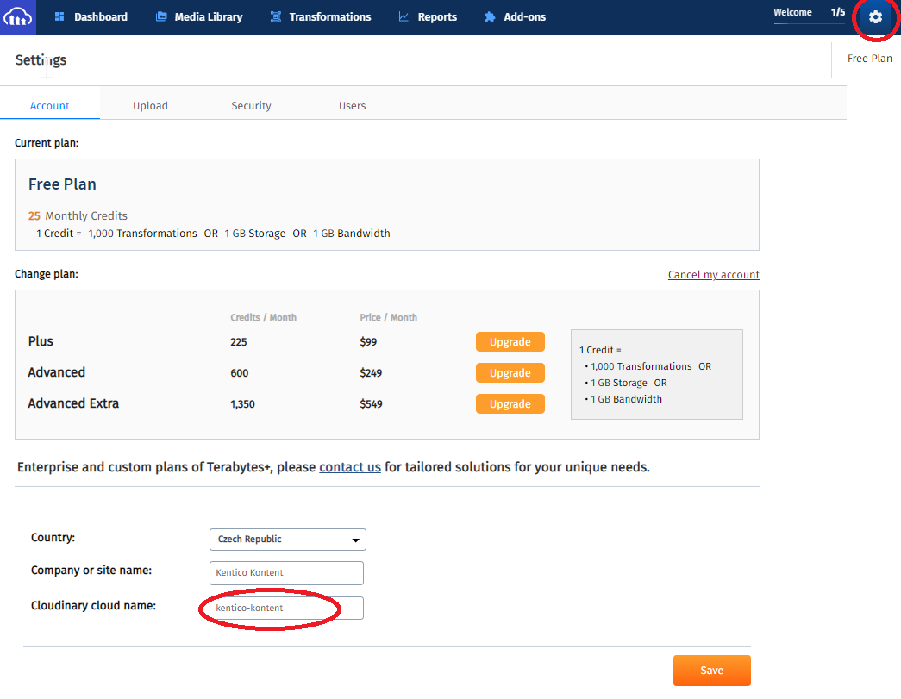
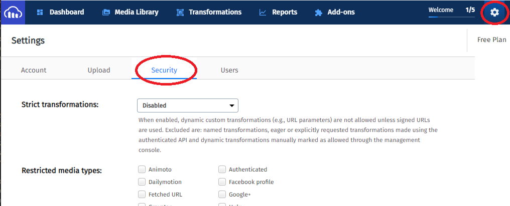
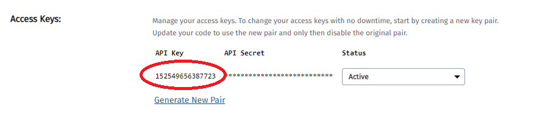

[![Core integration][core-shield]](https://kontent.ai/integrations/cloudinary)
[![Gallery][gallery-shield]](https://kentico.github.io/kontent-custom-element-samples/gallery/)

![Last modified][last-commit]
[![Issues][issues-shield]][issues-url]
[![Contributors][contributors-shield]][contributors-url]
[![Forks][forks-shield]][forks-url]
[![MIT License][license-shield]][license-url]

[![Stack Overflow][stack-shield]](https://stackoverflow.com/tags/kentico-kontent)
[![GitHub Discussions][discussion-shield]](https://github.com/Kentico/Home/discussions)

<p align="center">
<image src="docs/kk-logo.svg" alt="kontent logo" width="200" />
<image src="docs/cloudinary_logo.png" 
alt="cloudinary logo" width="400">
</p>

<p align="center">
  <a href="#features">Features</a> •
  <a href="#demo">Demo</a> •
  <a href="#quick-deploy">Deploy</a> •
  <a href="#configuring-the-custom-element">Configuration</a> •
  <a href="#what-is-saved">Saved value</a> •
  <a href="#contributors">Contributors</a> •
  <a href="#license">License</a> •
  <a href="#additional-resources">Resources</a>
</p>

This [custom element](https://kontent.ai/learn/tutorials/develop-apps/integrate/content-editing-extensions) extension for [Kontent by Kentico](https://kontent.ai) allows users to link selected assets from their [Cloudinary](https://cloudinary.com/) asset library into their structured content. It also provides editors with the ability to upload and manage their assets directly through the extension.

## Features

- Editors are able to
  - Search for assets in their Cloudinary Asset Library
  - Link selected assets with their content items with preview directly inside of the Kontent editor
  - Upload & Manage assets directly through the widget from the Kontent editor
  

## Demo

![Demo Animation][product-demo]

## Quick Deploy

Netlify has made this easy. If you click the deploy button below, it will guide you through the process of deploying it to Netlify and leave you with a copy of the repository in your account as well.

[](https://app.netlify.com/start/deploy?repository=https://github.com/Kentico/kontent-custom-element-cloudinary)

## Cloudinary setup
The integration uses **[the official Media Library Widget by Cloudinary](https://cloudinary.com/documentation/media_library_widget)**. In order to access your asset library you'll need a Cloud Name and an API Key. 

### Getting the Cloudinary Cloud Name
The Cloud Name can be found inside of the **Settings** section in your Cloudinary application. Under the **Account** subsection you'll find the **Cloudinary cloud name** at the bottom of the page.



### Creating a new API Key
Subsequently, you'll have to create an API key for the the widget. You'll find that option in the **Settings** section under the **Security** tab as shown on the image below.

At the bottom of the page you'll find a section called **Acess Keys**. There might be a key already generated for you, otherwise, you'll have to generate a new one through the **Generate New Pair**. This will create a new API Key and an API Secret, but only the Key will be neccessary for the custom element to work.
 option.

## Configuring the Custom Element
The section above explains how to find values for the below mentioned parameters in the Cloudinary application. 
You will need to add the custom element to a content type filling in the hosted code URL and the JSON parameters as follows (*defaultTransformations* is an optional parameter):

```
{
    "cloudName": "<YOUR CLOUDINARY CLOUD NAME>",
    "apiKey": "<YOUR API KEY>",
    "defaultTransformations": "<TRANSFORMATIONS>"
}
```

## What is Saved
Assets selected from Cloudinary are saved as an array of objects into the value of the custom element. This is also the format they will be delivered as through the Kontent's Delivery API.

More details about the individual properties can be found [in the official Cloudinary documentation](https://cloudinary.com/documentation/media_library_widget).

Example custom element value:
```
{
  assets: [
    {
      "public_id": "sample",
      "resource_type": "image",
      "type": "upload",
      "format": "jpg",
      "version": 1511474034,
      "url": "http://res.cloudinary.com/demo/image/upload/v1511474034/sample.jpg",
      "secure_url": "https://res.cloudinary.com/demo/image/upload/v1511474034/sample.jpg",
      "width": 864,
      "height": 576,
      "bytes": 120257,
      "duration": null,
      "tags": [],
      "context": [],
      "created_at": "2017-11-23T21:53:54Z",
      "derived": [
        {
          "url": "http://res.cloudinary.com/demo/image/upload/c_scale,e_grayscale,f_auto,q_auto,w_100/v1511474034/sample.jpg",
          "secure_url": "https://res.cloudinary.com/demo/image/upload/c_scale,e_grayscale,f_auto,q_auto,w_100/v1511474034/sample.jpg"
        }
      ]
    }
  ]
}
```

## Contributors
This custom element was originally created by <a href="https://www.truelime.nl/">TrueLime</a>.

<a href="https://github.com/Kentico/kontent-custom-element-cloudinary/graphs/contributors">
  
</a>

We have collected notes on how to contribute to this project in [CONTRIBUTING.md](CONTRIBUTING.md).

## License

[MIT](https://tldrlegal.com/license/mit-license)

## Additional Resources

- [Custom Element Gallery on github](https://kentico.github.io/kontent-custom-element-samples/gallery/)
- [Kontent's Integration documentation](https://kontent.ai/learn/tutorials/develop-apps/integrate/integrations-overview)
- [Custom Element documentation](https://kontent.ai/learn/tutorials/develop-apps/integrate/content-editing-extensions)
- [Custom Element API reference](https://kontent.ai/learn/reference/custom-elements-js-api)


[last-commit]: https://img.shields.io/github/last-commit/Kentico/kontent-custom-element-cloudinary?style=for-the-badge
[contributors-shield]: https://img.shields.io/github/contributors/Kentico/kontent-custom-element-cloudinary.svg?style=for-the-badge
[contributors-url]: https://github.com/Kentico/kontent-custom-element-cloudinary/graphs/contributors
[forks-shield]: https://img.shields.io/github/forks/Kentico/kontent-custom-element-cloudinary.svg?style=for-the-badge
[forks-url]: https://github.com/Kentico/kontent-custom-element-cloudinary/network/members
[stars-shield]: https://img.shields.io/github/stars/Kentico/kontent-custom-element-cloudinary.svg?style=for-the-badge
[stars-url]: https://github.com/Kentico/kontent-custom-element-cloudinary/stargazers
[issues-shield]: https://img.shields.io/github/issues/Kentico/kontent-custom-element-cloudinary.svg?style=for-the-badge
[issues-url]: https://github.com/Kentico/kontent-custom-element-cloudinary/issues
[license-shield]: https://img.shields.io/github/license/Kentico/kontent-custom-element-cloudinary.svg?style=for-the-badge
[license-url]: https://github.com/Kentico/kontent-custom-element-cloudinary/blob/master/LICENSE
[core-shield]: https://img.shields.io/static/v1?label=&message=core%20integration&color=FF5733&style=for-the-badge
[gallery-shield]: https://img.shields.io/static/v1?label=&message=extension%20gallery&color=51bce0&style=for-the-badge
[stack-shield]: https://img.shields.io/badge/Stack%20Overflow-ASK%20NOW-FE7A16.svg?logo=stackoverflow&logoColor=white&style=for-the-badge
[discussion-shield]: https://img.shields.io/badge/GitHub-Discussions-FE7A16.svg?logo=github&style=for-the-badge
[product-demo]: docs/cloudinary.gif?raw=true
