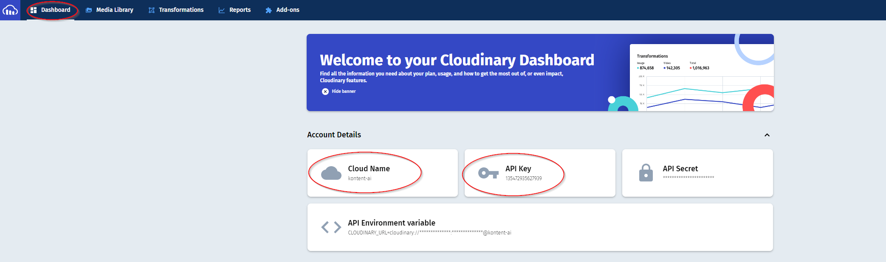

[![Core integration][core-shield]](https://kontent.ai/integrations/cloudinary)

![Last modified][last-commit]
[![Issues][issues-shield]][issues-url]
[![Contributors][contributors-shield]][contributors-url]
[![Forks][forks-shield]][forks-url]
[![MIT License][license-shield]][license-url]

[![Stack Overflow][stack-shield]](https://stackoverflow.com/tags/kontent-ai)
[![Discord][discord-shield]](https://discord.gg/SKCxwPtevJ)

<p align="center">
<picture>
  <source media="(prefers-color-scheme: dark)" srcset="docs/kai-logo-hor-neg-rgb.svg">
  
</picture>
<image src="docs/cloudinary_logo.png" alt="cloudinary logo" width="300">
</p>

<p align="center">
  <a href="#features">Features</a> •
  <a href="#demo">Demo</a> •
  <a href="#getting-started">Getting started</a> •
  <a href="#configuring-the-custom-element">Configuration</a> •
  <a href="#what-is-saved">Saved value</a> •
  <a href="#contributors">Contributors</a> •
  <a href="#license">License</a> •
  <a href="#additional-resources">Resources</a>
</p>

This [custom element](https://kontent.ai/learn/tutorials/develop-apps/integrate/content-editing-extensions) extension for [Kontent.ai](https://kontent.ai) allows users to link selected assets from their [Cloudinary](https://cloudinary.com/) asset library into their structured content. It also provides editors with the ability to upload and manage their assets directly through the extension.

## Features

- Editors are able to
  - Search for assets in their Cloudinary Asset Library
  - Link selected assets with their content items with preview directly inside of the Kontent.ai editor
  - Upload & Manage assets directly through the widget from the Kontent.ai editor

## Demo

![Demo Animation][product-demo]

## Getting started

### Quick deploy

Netlify has made this easy. If you click the deploy button below, it will guide you through the process of deploying it to Netlify and leave you with a copy of the repository in your account as well.

[](https://app.netlify.com/start/deploy?repository=https://github.com/kontent-ai/integration-cloudinary)

### Running manually

The integration is created with [Vite](https://vitejs.dev/). First you will need to install npm dependencies with `npm ci`. Then use `npm run build` to build the integration or `npm run dev` to start a local development server.

## Cloudinary setup

The integration uses **[the official Media Library Widget by Cloudinary](https://cloudinary.com/documentation/media_library_widget)**. In order to access your asset library you'll need a Cloud Name and an API Key.

### Getting the Cloudinary Cloud Name and API Key

You can find the **cloud name** and the **API key** in the **Account details** section of the **Dashboard** in your Cloudinary application.


### Creating a new API Key

If you want to create a new API key, you can follow instructions in [this article](https://support.cloudinary.com/hc/en-us/articles/202520942-How-do-I-create-a-new-API-key-and-API-secret-or-remove-an-old-key-).

## Configuring the Custom Element

The section above explains how to find values for the below-mentioned parameters in the Cloudinary application.
You will need to add the custom element to a content type filling in the hosted code URL and the JSON parameters as follows (_defaultTransformation_ is an optional parameter):

```
{
    "cloudName": "<YOUR CLOUDINARY CLOUD NAME>",
    "apiKey": "<YOUR API KEY>",
    "defaultTransformation": "<TRANSFORMATION>"
}
```

## What is Saved

Assets selected from Cloudinary are saved as an array of objects into the value of the custom element. This is also the format they will be delivered as through the Kontent.ai Delivery API.

More details about the individual properties can be found [in the official Cloudinary documentation](https://cloudinary.com/documentation/media_library_widget).

Example custom element value:

```
{
  assets: [
    {
      "public_id": "sample",
      "resource_type": "image",
      "type": "upload",
      "format": "jpg",
      "version": 1511474034,
      "url": "http://res.cloudinary.com/demo/image/upload/v1511474034/sample.jpg",
      "secure_url": "https://res.cloudinary.com/demo/image/upload/v1511474034/sample.jpg",
      "width": 864,
      "height": 576,
      "bytes": 120257,
      "duration": null,
      "tags": [],
      "context": [],
      "created_at": "2017-11-23T21:53:54Z",
      "derived": [
        {
          "url": "http://res.cloudinary.com/demo/image/upload/c_scale,e_grayscale,f_auto,q_auto,w_100/v1511474034/sample.jpg",
          "secure_url": "https://res.cloudinary.com/demo/image/upload/c_scale,e_grayscale,f_auto,q_auto,w_100/v1511474034/sample.jpg"
        }
      ]
    }
  ]
}
```

## Contributors

This custom element was originally created by <a href="https://www.truelime.nl/">TrueLime</a>.

<a href="https://github.com/kontent-ai/integration-cloudinary/graphs/contributors">
  
</a>

We have collected notes on how to contribute to this project in [CONTRIBUTING.md](CONTRIBUTING.md).

## License

[MIT](https://tldrlegal.com/license/mit-license)

## Additional Resources

- [Kontent.ai Integration documentation](https://kontent.ai/learn/tutorials/develop-apps/integrate/integrations-overview)
- [Custom Element documentation](https://kontent.ai/learn/tutorials/develop-apps/integrate/content-editing-extensions)
- [Custom Element API reference](https://kontent.ai/learn/reference/custom-elements-js-api)

[last-commit]: https://img.shields.io/github/last-commit/kontent-ai/integration-cloudinary?style=for-the-badge
[contributors-shield]: https://img.shields.io/github/contributors/kontent-ai/integration-cloudinary.svg?style=for-the-badge
[contributors-url]: https://github.com/kontent-ai/integration-cloudinary/graphs/contributors
[forks-shield]: https://img.shields.io/github/forks/kontent-ai/integration-cloudinary.svg?style=for-the-badge
[forks-url]: https://github.com/kontent-ai/integration-cloudinary/network/members
[stars-shield]: https://img.shields.io/github/stars/kontent-ai/integration-cloudinary.svg?style=for-the-badge
[stars-url]: https://github.com/kontent-ai/integration-cloudinary/stargazers
[issues-shield]: https://img.shields.io/github/issues/kontent-ai/integration-cloudinary.svg?style=for-the-badge
[issues-url]: https://github.com/kontent-ai/integration-cloudinary/issues
[license-shield]: https://img.shields.io/github/license/kontent-ai/integration-cloudinary.svg?style=for-the-badge
[license-url]: https://github.com/kontent-ai/integration-cloudinary/blob/master/LICENSE
[core-shield]: https://img.shields.io/static/v1?label=&message=core%20integration&color=FF5733&style=for-the-badge
[stack-shield]: https://img.shields.io/badge/Stack%20Overflow-ASK%20NOW-FE7A16.svg?logo=stackoverflow&logoColor=white&style=for-the-badge
[discord-shield]: https://img.shields.io/discord/821885171984891914?label=Discord&logo=Discord&logoColor=white&style=for-the-badge
[product-demo]: docs/cloudinaryElement.gif?raw=true
